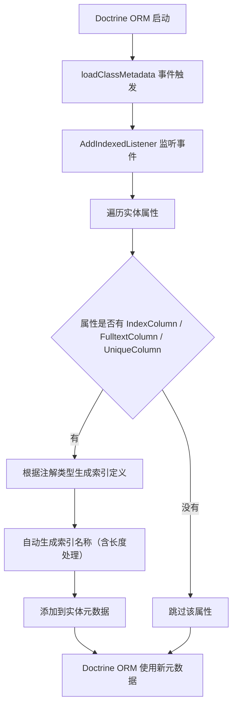

# Doctrine Indexed Bundle 工作原理流程图（Mermaid）

```mermaid
flowchart TD
    A[Doctrine ORM 启动] --> B[loadClassMetadata 事件触发]
    B --> C[AddIndexedListener 监听事件]
    C --> D[遍历实体属性]
    D --> E{属性是否有 IndexColumn / FulltextColumn / UniqueColumn}
    E -- 有 --> F[根据注解类型生成索引定义]
    F --> G[自动生成索引名称（含长度处理）]
    G --> H[添加到实体元数据]
    E -- 没有 --> I[跳过该属性]
    H --> J[Doctrine ORM 使用新元数据]
    I --> J
```

> 本流程图描述了 Doctrine Indexed Bundle 如何自动为实体属性添加索引的主要工作流程。
